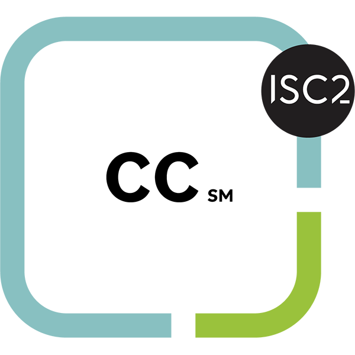
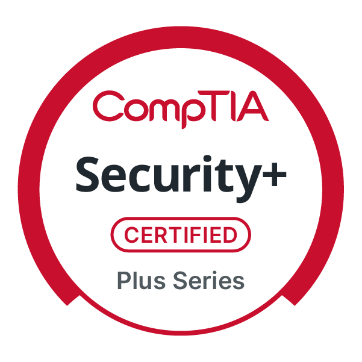
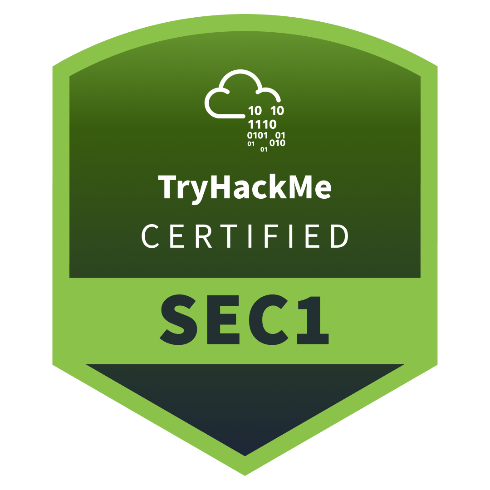

# 👋 Hi, I'm Jean
**SOC/Security Analyst · Blue Team · Security Operations**

Aspiring cybersecurity professsional with hands-on experience building detection and
response environments from scratch. For fun I did some homelabs to strengthen my knowledge about cybersecurity. My labs mirror
real-world SOC workflows using Splunk, Microsoft Sentinel, Azure, and etc.

---

## 🔐 Featured projects

### 🗺️ [Honeypot SOC Lab — Azure + Microsoft Sentinel](https://github.com/jean-celeste/SOC_Sentinel_Proj/tree/main)
Deployed a deliberately exposed Azure VM to capture real-world attacker traffic.
Configured Microsoft Sentinel with KQL detection rules, automated email alerting
via Logic App, and built a threat map workbook visualizing attacker geolocations.

`Microsoft Sentinel` `Azure VM` `KQL` `Logic App` `Threat Map` `GeoIP`

---

### 🔁 [Active Directory SOC Lab — Splunk + SOAR](https://github.com/jean-celeste/SOC-AD-CLOUD-Proj)
Simulated AD environment on Vultr cloud. Deployed Splunk for log aggregation,
integrated Shuffle (SOAR) for automated response, and configured Slack/email
alerting. Focused on brute force detection end-to-end.

`Splunk` `Shuffle SOAR` `Active Directory` `Vultr` `Sysmon`

---

### 🛡️ [SOC Home Lab — Splunk SIEM](https://github.com/jean-celeste/SOC_Lab_Splunk)
End-to-end SOC workflow: telemetry collection → detection → investigation → response.
Built with Splunk, Sysmon, and Windows Event Logs across 5 attack scenarios
with NIST-based incident response playbooks.

> 🏆 5 attack scenarios · detection rules · IR playbooks · dashboards

`Splunk` `Sysmon` `Windows Event Logs` `SPL` `NIST IR`

---

## 🏆 Certifications

  
  
  

---

## 🛠 Skills & tools

**SIEM & Detection:** `Splunk` `Microsoft Sentinel` `KQL` `SPL` `Sysmon`  
**Cloud & Infrastructure:** `Azure` `Vultr` `Active Directory` `Windows Server` `Ubuntu`  
**Automation & Response:** `Shuffle SOAR` `Logic Apps` `Slack Alerting`  
**Frameworks:** `MITRE ATT&CK` `NIST IR` `Threat Intelligence`

---

*Open to entry-level SOC analyst roles and security operations collaboration.*
    
